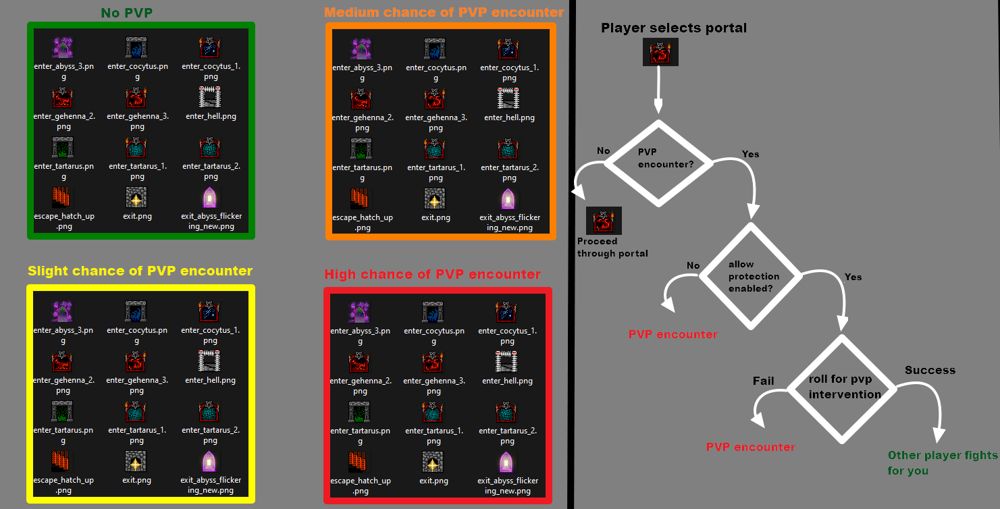
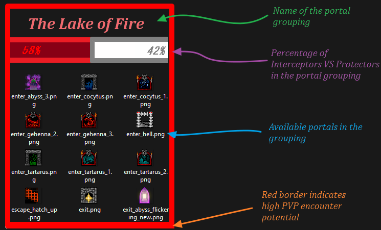
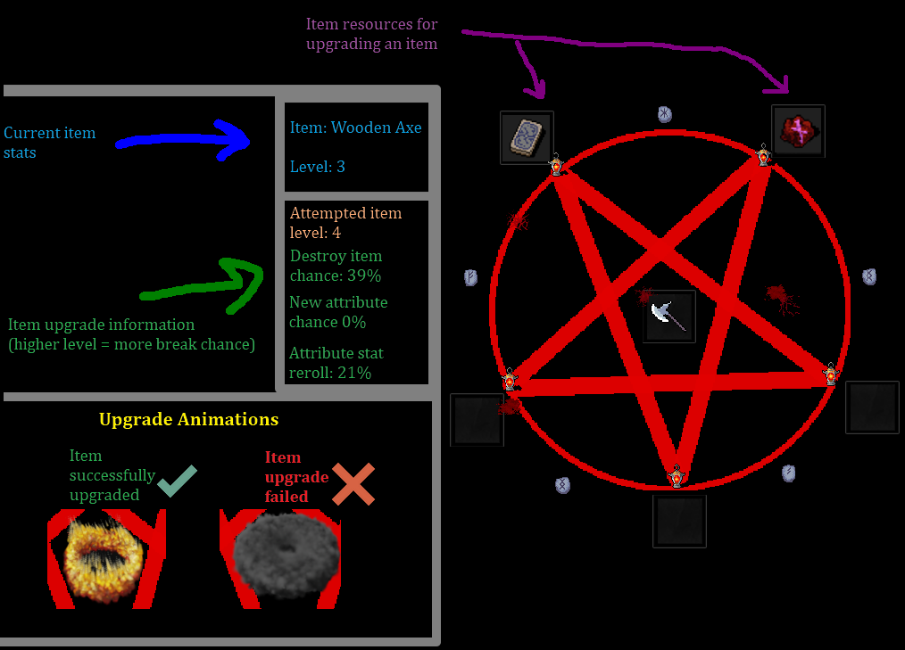

# Mort

### Description
Mort is an open source game (eventually an MMORPG) that uses the Python Arcade engine and FastAPI. This game is designed to be 
as <ins>brutal</ins> as possible with key concepts such as risky item upgrades and full loot PVP. The player should 
**at all times** feel they are balancing <ins>risk</ins> vs <ins>reward</ins>. The game will always be 100% 
free with the eventual possibility for donations to support server costs and efforts. 

### Discussion about Mort
Discussions about Mort can be found within the Go Getter Guild under the mort-rpg channel. https://discord.gg/Gn8jnFWHx9 

### Portal System
Players have the choice of 4 instanced PVM portal groupings. Every portal grouping (after the first) will have an increased
chance of a PVP encounter and increased PVM loot chances. When a player selects a portal their soul will attempt to travel to the 
PVM instance location specified by the portal name. During travel, a player's soul can be intercepted by "Soul Interceptors". 
If your soul is intercepted by an Interceptor, there will be a chance your soul will be protected via a "Soul Protector"
(if enabled). This will allow another player of a similar level to fight in your place for you! This option can be turned off and is 
<ins>not</ins> guaranteed to work.

### Roles
#### Soul Interceptors (PVP)
* Evil players seeking to steal the souls of portal travelers.  
* Successful PVP kill will reward the Interceptor with the loot of the soul traveler or Protector and the chance of obtaining 
"Cursed Souls".
#### Soul Protectors (PVP)
* Lawful players seeking to protect the souls of portal travelers.  
* Successful PVP kill will reward the Protector with the loot of the Interceptor and the chance of obtaining "Blessed Souls"
#### Portal Travelers (PVM and PVP if outside the green portal grouping)
* Neutral players seeking to travel through portals to PVM instances.
* While encountering a Soul Interceptor and a death occurs, all items in the traveler's inventory will be lost. 

### Upgrading

### OTHER TOPICS 
TODO

### Technical Components 
#### Front end
* Python Arcade https://api.arcade.academy/en/latest/
#### Back end
* FastAPI https://fastapi.tiangolo.com/

### Contributing
See the contributing document
