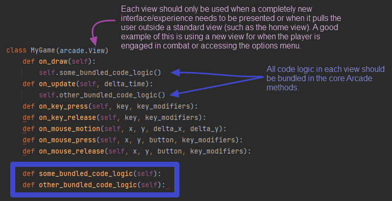

## Contributing
Contributions are 100% volunteer. All assets are open source and can be found mostly from 
https://opengameart.org/. I'm thankful for meaningful and thoughtful contributions regardless of skill or frequency. 
I (BrettskiPy) will do my best to keep the project moving in the general creative direction I envision.

### How to contribute
Before contributing, please check the list of needed contributions below and send me a message on Discord with your 
ideas and/or talents. If you would like to work directly on the specific needs of the project feel free to take 
on one of the GitHub issue tickets.

#### Backend contributions needed
* Database
* FastAPI 
* Testing (manual or automated)
* DevOps CI/CD 

#### Frontend contributions needed
* Pixel Art
* Animations 
* Python Arcade code submissions via PR

### Where to contribute
The Mort repo found here https://github.com/BrettskiPy/mort

### General frontend Arcade structure
Code logic should be bundled within the standard Python Arcade methods. A good place to view these methods 
can be found here
